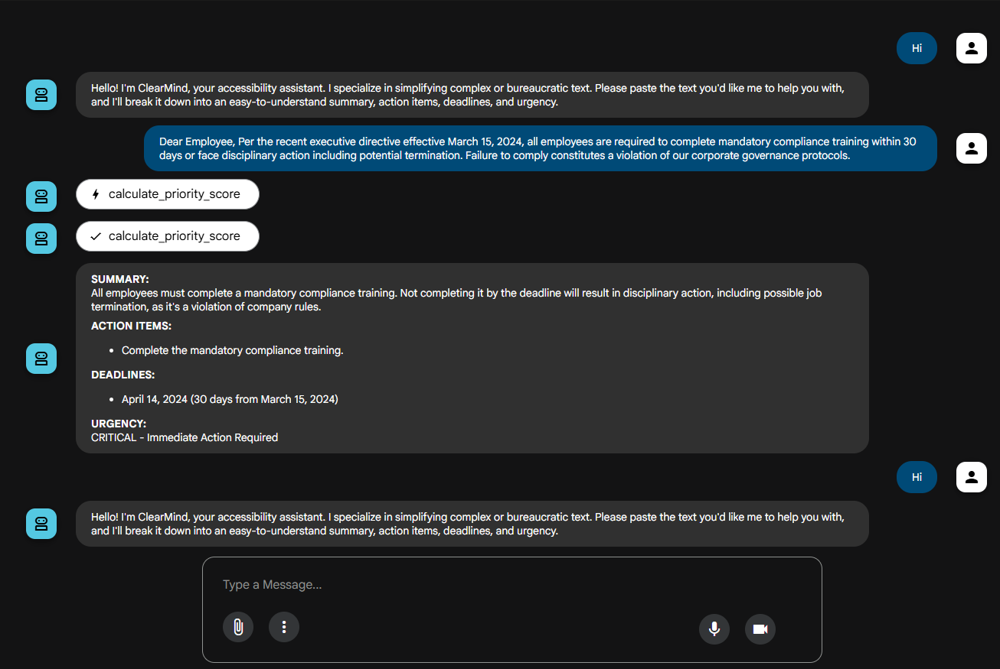

# ClearMind: Cognitive Load Reducer Agent

## Overview

**ClearMind** is an AI-powered accessibility agent built with Google's Agent Development Kit (ADK) and Gemini 2.5 Flash model. It simplifies complex or bureaucratic text and provides actionable insights for users.

The agent is designed to help reduce cognitive load by:
- Summarizing complex information into simple language
- Extracting key action items
- Identifying critical deadlines
- Calculating priority levels for tasks

## Features

✅ **Text Simplification** - Converts complex, bureaucratic language into clear, understandable summaries  
✅ **Smart Priority Scoring** - Uses custom tools to calculate urgency based on deadlines and financial/legal implications  
✅ **Structured Output** - Returns organized responses with:
   - Summary
   - Action Items
   - Deadlines
   - Urgency Level

✅ **Cloud-Ready** - Deployable to Google Cloud Run as an HTTP endpoint  

## Tech Stack

- **Framework**: Google Agent Development Kit (ADK)
- **Model**: Gemini 2.5 Flash
- **Language**: Python 3.8+
- **Dependencies**:
  - `google-adk` - Agent development framework

## Project Structure

```
clear_mind/
├── agent.py              # Main agent implementation
├── requirements.txt      # Python dependencies
├── __init__.py          # Package initialization
└── README.md            # This file
```

## Installation

### Prerequisites
- Python 3.8 or higher
- Google Cloud SDK (for Cloud Run deployment)
- Google Cloud Project with Gemini API enabled
- Valid Google Cloud credentials

### Setup

1. **Clone or navigate to the project directory**
   ```bash
   cd clear_mind
   ```

2. **Create a virtual environment** (recommended)
   ```bash
   python -m venv venv
   source venv/bin/activate  # On Windows: venv\Scripts\activate
   ```

3. **Install dependencies**
   ```bash
   pip install -r requirements.txt
   ```

4. **Configure Google Cloud credentials**
   ```bash
   gcloud auth application-default login
   ```

## Usage

### Local Testing

The agent can be invoked directly in Python:

```python
from agent import root_agent

# Define user input
user_input = """
Your final notice: Pay $5000 by March 31st or we will initiate legal proceedings 
against you for breach of contract. This is a compliance requirement per section 4.2.1.
"""

# Invoke the agent
response = root_agent.run(user_input)
print(response)
```

### Expected Output Format

```
**SUMMARY:**
You need to pay $5000 by March 31st, or face legal action.

**ACTION ITEMS:**
- Pay $5000
- Review contract section 4.2.1

**DEADLINES:**
- March 31st - Payment deadline

**URGENCY:**
CRITICAL - Immediate Action Required
```

### Test the Agent via HTTP endpoint
Once deployed, you'll receive a Cloud Run URL. Test it:

```bash
curl -X POST https://YOUR_CLOUD_RUN_URL \
  -H "Content-Type: application/json" \
  -d '{
    "text": "You must submit your expense report by Friday or you will not be reimbursed per company policy."
  }'
```

### Test the Agent via GUI
use `adk web` command to open in GUI

## Agent Capabilities

### Custom Tool: `calculate_priority_score`

The agent uses a specialized tool to calculate task priority:

| Condition | Priority Level |
|-----------|-----------------|
| Has deadline + Legal/Financial | ⚠️ **CRITICAL** - Immediate Action Required |
| Has deadline only | 🔴 **HIGH** - Time Sensitive |
| Legal/Financial only | 🟡 **MEDIUM** - Important but not strictly timed |
| Neither | 🟢 **ROUTINE** - Process when able |

## Architecture

```
User Input (Text)
    |
    v
ClearMind Agent (Gemini 2.5 Flash)
    |
    +-- calculate_priority_score tool
    |       |
    |       v
    |   (Detect deadline? Legal/Financial?)
    |
    v
Formatted Response
    ├-- SUMMARY
    ├-- ACTION ITEMS
    ├-- DEADLINES
    └-- URGENCY
```

## API Reference

### Request

```json
POST /
Content-Type: application/json

{
  "text": "Your complex bureaucratic text here..."
}
```

### Response

```json
{
  "response": "**SUMMARY:**\n...\n\n**ACTION ITEMS:**\n...\n\n**DEADLINES:**\n...\n\n**URGENCY:**\n..."
}
```
### Snapshot of the prototype

